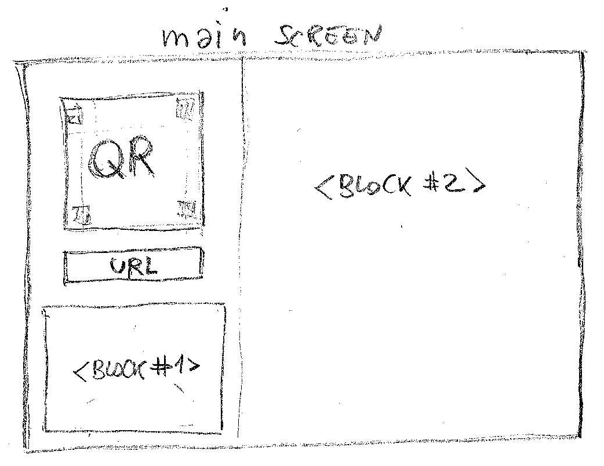
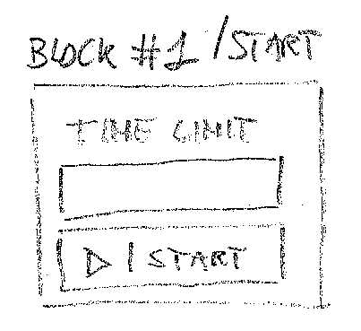

ID: ?

Status: DRAFT

Priority: ?

Effort: ?

As:
`trainer`

I want to:
create a quiz session, start it, optionally with a timelimit, observe how the session is panning out in term of students submitting their quiz and number of questions being answered and time remaining and then finish the session (either maybe because everyone finisched before the limit or because I decided so because it was just a feedback quiz)

So that:
I can control and share how the quiz is progressing, and control the session.

# Workflow and Wireframe:
1. as a trainer I can browse the list of quizzes
2. I can create a quiz sessions. A quiz session is an occurrence of a quiz taking. Several sessions on the main course can be opened because maybe na exam needs to be retaken.
3. when I create a new quiz session I can access its several pages. This story is specifically about "public page". Other pages I will eplain in other stories.
4. the "public page" (find it a better name) shows the status of the session as depicted in 
    - QR emebed the URL the students can browse to access the quiz
    - URL field contains the same URL that is embedded in the QR
    - BLOCK#1 depends on the status of the session that can be: 1. CLOSED (session is created but nobody can access the quiz), 2. OPEN (session is underway, students can answer). A session can be always reopend.

    When course is CLOSED BLock#1 is 
    A "Start button" starts the session. If I put a time limit in the format 3h (for 3 hourse, 75m for 75 minutes) the session will automatically close after that that time elapses.

    when course is OPEN BLock1 is [Block1Open](block1.running.png) where it shows the time left if started with a time limit or a time elapsed if not. There is also a stop button to close the session.

    the BLOCK2 when session not started prints some information messages as "quix not yet started" and the number of studentw currently connected to the session [Block2Prestart](block2.prestart.png)

    when session is open it shows two progress bars.
    an "answer" progress bar showing the percentage of question answered for the total of students connected to the session, and a progress bar with the remaining time [Block2Running](block2.running.png)

    after session stops block2 show the number of answers submitted and how many questions have been anwered.

